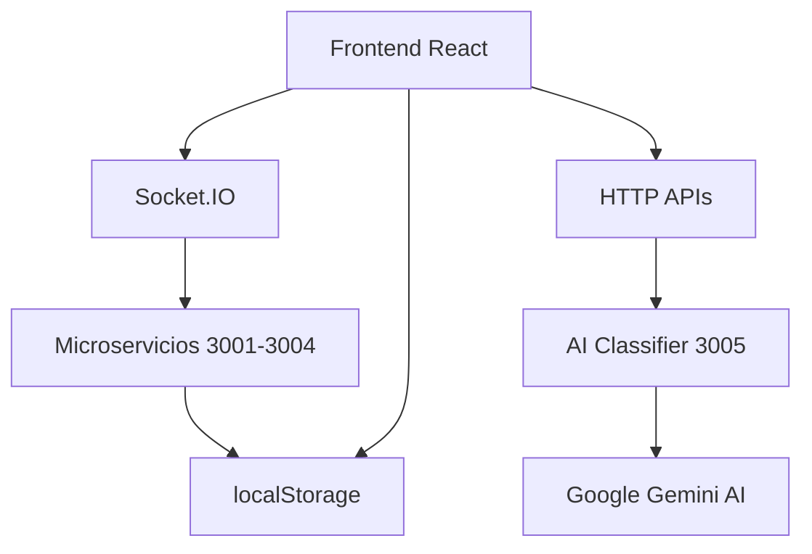

# JARVI - Documentación Técnica
*Última actualización: 11 de Agosto, 2025*

## 📋 Índice
1. [Arquitectura del Sistema](#arquitectura)
2. [Módulos y Componentes](#modulos)
3. [APIs y Endpoints](#apis)
4. [Guía de Desarrollo](#desarrollo)
5. [Testing y QA](#testing)
6. [Deployment](#deployment)

---

## 🏗️ Arquitectura del Sistema {#arquitectura}

### Stack Tecnológico
```
Frontend (Puerto 5173)
├── React 18.2.0
├── Vite 7.1.1  
├── Tailwind CSS
├── Framer Motion
└── Lucide React

Backend (Puertos 3001-3005)
├── Node.js + Express
├── Socket.IO
├── Google Gemini AI
├── Axios
└── CORS configurado
```

### Flujo de Datos


---

## 🧩 Módulos y Componentes {#modulos}

### 1. Dashboard Principal
**Archivo**: `src/components/ModernMainDashboard.jsx`

**Props**:
```javascript
// No recibe props externos - Es el componente raíz
```

**Estado**:
```javascript
const [activeModule, setActiveModule] = useState('dashboard')
const [searchTerm, setSearchTerm] = useState('')
const [sidebarCollapsed, setSidebarCollapsed] = useState(false)
```

**Características**:
- ✅ Navegación modular
- ✅ Sidebar responsivo
- ✅ Búsqueda de módulos
- ✅ Gestión de cambios no guardados

### 2. Notas de Voz Avanzadas
**Archivo**: `src/components/EnhancedVoiceNotesModule.jsx`

**Props**:
```javascript
// Componente autónomo sin props
```

**Estado Principal**:
```javascript
const [voiceNotes, setVoiceNotes] = useState([])
const [currentlyPlaying, setCurrentlyPlaying] = useState(null)
const [transcribingNotes, setTranscribingNotes] = useState(new Set())
const [activeTab, setActiveTab] = useState('notes') // 'notes' | 'search'
```

**Funcionalidades**:
- ✅ Reproducción de audio
- ✅ Transcripción automática con IA
- ✅ Tabs: Lista y Búsqueda
- ✅ Procesamiento con VoiceNotesProcessor
- ✅ Generación automática de prompts
- ✅ Estadísticas de IA en tiempo real

**Endpoints Utilizados**:
- `GET /voice-notes` - Obtener notas
- `POST /transcribe` - Transcribir audio
- `WebSocket` - Updates en tiempo real

### 3. Búsqueda Avanzada
**Archivo**: `src/components/VoiceNotesSearch.jsx`

**Props**:
```javascript
interface VoiceNotesSearchProps {
  notes: Array<VoiceNote>
  onNoteSelect: (note: VoiceNote) => void
  currentAudioUrl?: string
}
```

**Características Técnicas**:
- **Índice Invertido**: O(1) búsqueda por palabras
- **Algoritmo de Relevancia**: Basado en coincidencias, proximidad y recencia
- **Regex Support**: Búsqueda con expresiones regulares
- **Context Extraction**: Líneas antes/después con timestamps
- **Filtros Múltiples**: Fecha, categoría, tags, duración

**Performance**:
```javascript
// Debounce de 300ms para evitar búsquedas excesivas
useEffect(() => {
  const debounceTimer = setTimeout(() => {
    performSearch();
  }, 300);
  return () => clearTimeout(debounceTimer);
}, [searchQuery, filters]);
```

### 4. Editor de Prompts
**Archivo**: `src/components/PromptEditor.jsx`

**Props**:
```javascript
interface PromptEditorProps {
  initialPrompt?: string
  onSave: (prompt: string) => void
  onCancel: () => void
  title?: string
  showPreview?: boolean
  context?: string
  promptType?: string
}
```

**Shortcuts Predefinidos**:
```javascript
const defaultShortcuts = [
  {
    trigger: '::precaution',
    text: 'ANTES DE HACER CUALQUIER MODIFICACION de codigo o configuracion dame 3 opciones de hacerlo y dime una recomendacion PREGUNTAME ANTES',
    icon: '⚠️'
  },
  // ... más shortcuts
];
```

**Integración con Storage**:
- `jarvi_saved_prompts` - Prompts guardados
- `jarvi_shortcuts` - Shortcuts personalizados
- `jarvi_prompt_history` - Historial (últimos 20)

### 5. Generador Automático de Prompts
**Archivo**: `src/components/AutoPromptGenerator.jsx`

**Props**:
```javascript
interface AutoPromptGeneratorProps {
  transcription: string
  voiceNote?: VoiceNote
  onPromptsGenerated: (prompts: Array<GeneratedPrompt>) => void
  onClose: () => void
}
```

**Módulos Soportados**:
```javascript
const availableModules = [
  {
    id: 'tasks',
    name: 'Tareas',
    icon: '✅',
    promptTemplate: 'Crear tarea: {content}',
    keywords: ['tarea', 'hacer', 'pendiente', 'completar']
  },
  // ... 5 módulos más
];
```

**Flujo de Procesamiento**:
1. **Análisis** → `POST /api/classify`
2. **Detección** → Auto-selección de módulos
3. **Generación** → `POST /api/generate-prompts`
4. **Validación** → Limpieza y formato
5. **Exportación** → JSON estructurado

### 6. Detección de Proyectos
**Archivo**: `src/components/ProjectDetector.jsx`

**Algoritmo de Detección**:
```javascript
const detectProjectFromContent = (text) => {
  // 1. Análisis de palabras clave por categoría
  // 2. Matching con proyectos existentes
  // 3. Scoring basado en coincidencias
  // 4. Confidence level calculation
  return {
    detected: boolean,
    project: Project | null,
    confidence: number,
    suggestions: Array<Project>
  }
}
```

---

## 🔌 APIs y Endpoints {#apis}

### Servidor de IA (Puerto 3005)
**Archivo**: `server-ai-classifier.js`

#### `POST /api/classify`
Clasificación completa con IA

**Request**:
```javascript
{
  content: string,
  context?: {
    currentProject?: string,
    availableProjects?: Array<Project>
  }
}
```

**Response**:
```javascript
{
  success: boolean,
  classification: {
    project: {
      detected: string | null,
      confidence: number,
      reasoning: string
    },
    priority: {
      level: 'critical' | 'high' | 'medium' | 'low',
      confidence: number,
      indicators: Array<string>
    },
    category: {
      main: 'bugfix' | 'feature' | 'refactor' | 'documentation' | 'other',
      confidence: number
    },
    tags: Array<string>,
    suggestedTitle: string,
    complexity: {
      level: 'simple' | 'medium' | 'complex',
      estimatedTime: string
    },
    technologies: Array<string>,
    sentiment: {
      tone: 'neutral' | 'positive' | 'negative' | 'urgent',
      emotion: string
    },
    actionItems: Array<string>,
    risks: Array<string>,
    dependencies: Array<string>
  }
}
```

#### `POST /api/generate-prompts`
Generación automática de prompts

**Request**:
```javascript
{
  transcription: string,
  modules: Array<ModuleDefinition>,
  maxLength?: number,
  themes?: Array<string>
}
```

**Response**:
```javascript
{
  success: boolean,
  prompts: Array<{
    module: string,
    moduleId: string,
    icon: string,
    prompt: string,
    confidence: number,
    themes: Array<string>
  }>
}
```

### Microservicios (Puertos 3001-3004)
- **3001**: Servidor principal
- **3002**: Notas de voz mejoradas
- **3003**: Tareas y recordatorios  
- **3004**: Reuniones

---

## 👨‍💻 Guía de Desarrollo {#desarrollo}

### Setup del Entorno
```bash
# Clonar repositorio
git clone [repo-url]
cd jarvi

# Instalar dependencias
npm install

# Variables de entorno
echo "GEMINI_API_KEY=tu_api_key" > .env

# Iniciar servicios
./start-network.sh

# Frontend estará en http://localhost:5173
```

### Estructura de Desarrollo
```
src/
├── components/          # Componentes React
│   ├── ModernMainDashboard.jsx
│   ├── EnhancedVoiceNotesModule.jsx
│   ├── VoiceNotesSearch.jsx
│   ├── PromptEditor.jsx
│   ├── AutoPromptGenerator.jsx
│   └── ...
├── config/             # Configuraciones
│   └── api.js
├── utils/              # Utilidades
└── styles/             # Estilos adicionales

Raíz:
├── server-ai-classifier.js    # Servidor IA
├── start-network.sh          # Script inicio
├── package.json              # Dependencies
└── README.md                 # Documentación
```

### Convenciones de Código

**Componentes React**:
```javascript
// Usar hooks y functional components
const ComponentName = ({ prop1, prop2 }) => {
  const [state, setState] = useState(defaultValue);
  
  useEffect(() => {
    // Side effects
  }, [dependencies]);
  
  return (
    <motion.div
      initial={{ opacity: 0 }}
      animate={{ opacity: 1 }}
      className="tailwind-classes"
    >
      {/* JSX */}
    </motion.div>
  );
};

export default ComponentName;
```

**Estado y Props**:
```javascript
// Props con destructuring y defaults
const Component = ({ 
  required, 
  optional = 'default',
  onCallback = () => {} 
}) => {
  // Estado local descriptivo
  const [isLoading, setIsLoading] = useState(false);
  const [data, setData] = useState([]);
  const [error, setError] = useState(null);
}
```

**Estilos Tailwind**:
```javascript
// Clases organizadas por categoría
className="
  // Layout
  flex items-center justify-between
  // Spacing  
  p-4 mb-2 gap-3
  // Colors & Background
  bg-white text-gray-900 border-gray-200
  // Interactive
  hover:bg-gray-50 transition-colors
  // Responsive
  md:flex-row sm:p-2
"
```

### Manejo de Errores
```javascript
// Try-catch con fallbacks
const apiCall = async () => {
  try {
    const response = await axios.post('/api/endpoint', data);
    if (response.data.success) {
      return response.data;
    } else {
      throw new Error(response.data.error);
    }
  } catch (error) {
    console.error('API Error:', error);
    // Fallback local si es posible
    return fallbackFunction(data);
  }
};
```

---

## 🧪 Testing y QA {#testing}

### Checklist de Funcionalidades

#### ✅ Dashboard Principal
- [x] Navegación entre módulos
- [x] Sidebar colapsable
- [x] Búsqueda de módulos
- [x] Responsive design

#### ✅ Notas de Voz
- [x] Reproducción de audio
- [x] Transcripción automática
- [x] Tabs Lista/Búsqueda
- [x] Generación automática de prompts

#### ✅ Búsqueda Avanzada
- [x] Búsqueda por texto
- [x] Filtros múltiples
- [x] Resaltado de keywords
- [x] Contexto con timestamps
- [x] RegEx support

#### ✅ Editor de Prompts
- [x] Shortcuts predefinidos
- [x] Historial con undo/redo
- [x] Guardado con tags
- [x] Generación automática de nombres

#### ✅ Generador Automático
- [x] Análisis con IA
- [x] Selección de módulos
- [x] Generación por módulo
- [x] Exportación JSON

### Testing Manual
```bash
# 1. Verificar servicios
curl http://localhost:3001/health
curl http://localhost:3005/api/classify -X POST -H "Content-Type: application/json" -d '{"content":"test"}'

# 2. Frontend
open http://localhost:5173

# 3. Funcionalidades principales
# - Navegación dashboard
# - Reproducción audio
# - Búsqueda avanzada  
# - Editor prompts
# - Generación automática
```

---

## 🚀 Deployment {#deployment}

### Producción
```bash
# Build frontend
npm run build

# Configurar variables de entorno
export GEMINI_API_KEY="production_key"
export NODE_ENV="production"

# Iniciar servicios en producción
pm2 start ecosystem.config.js
```

### Docker (Opcional)
```dockerfile
FROM node:18-alpine
WORKDIR /app
COPY package*.json ./
RUN npm ci --only=production
COPY . .
RUN npm run build
EXPOSE 3001 3005 5173
CMD ["npm", "start"]
```

---

## 📝 Changelog

### v1.3.0 (11 Ago 2025)
- ✅ Implementado VoiceNotesSearch completo
- ✅ AutoPromptGenerator con IA
- ✅ Light theme migration
- ✅ Integración completa de módulos

### v1.2.0 (10 Ago 2025)  
- ✅ PromptEditor avanzado
- ✅ ProjectDetector inteligente
- ✅ Cronología de proyectos

### v1.1.0 (Anterior)
- ✅ Dashboard modular
- ✅ Notas de voz básicas
- ✅ Transcripción con IA

---

## 🔧 Troubleshooting

### Problemas Comunes

**Puerto ocupado**:
```bash
lsof -ti:3005 | xargs kill -9
./start-network.sh
```

**Error de API Key**:
```bash
echo "GEMINI_API_KEY=tu_key_aqui" >> .env
```

**Frontend no carga**:
```bash
cd frontend/
npm install
npm run dev
```

---

*Esta documentación está actualizada y refleja el estado actual del proyecto JARVI.*